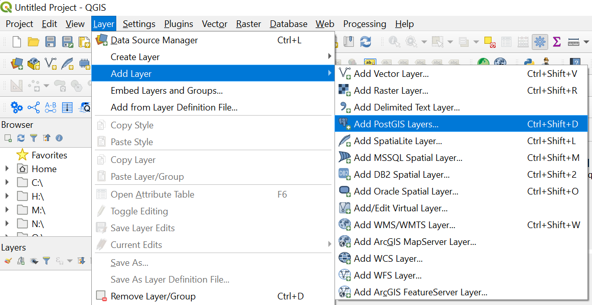
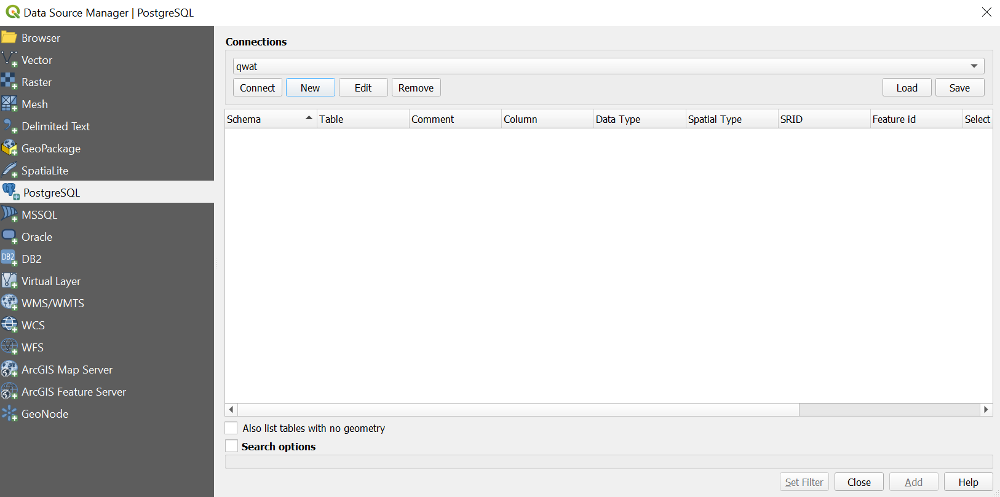
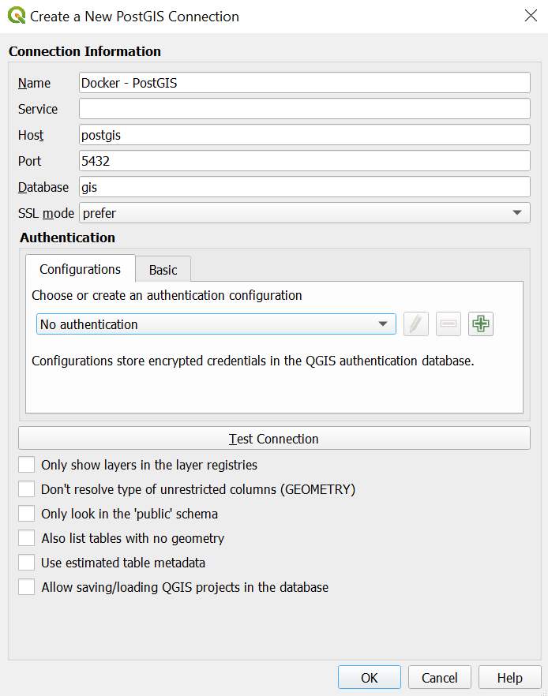
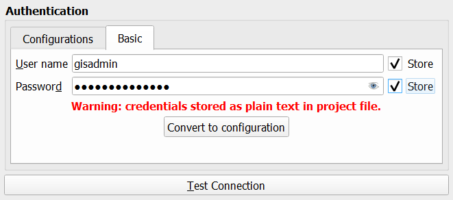

# How-to connect to the PostGIS Database using QGIS Desktop

This tutorial shows how-to connect to the dockerised PostGIS database (running on localhost) through your QGIS Desktop. Althought their are different ways to do it, the one described here will allow you to use resources from this database in Lizmap.

To do that, we will avoid to save database login/password in configuration and prefer writing the credential into the project file. Credentials saved in the QGIS Desktop configuration are not gonna be accessible by the Dockerised QGIS Server although QGIS Desktop and QGIS Server will read the same project file.

The idea then is to write the credentials into the project file.

## Getting started

Before starting, make sure the whole Docker project is running properly. Also ensure that you've added the "postgis" host in the etc/host file (C:\Windows\System32\drivers\etc). If not please refer to the "Run the project" section in this [page](./../README.md).

Start your QGIS Desktop then open the Data Source Manager (or get there by clicking "Add PostGIS layers" as in the following picture) to create a new PostGIS connexion.

## DB Connection

Once the Data Source Manager open, under the "PostgreSQL" tab, click the "New" button under the "Connections" section.

The "Create a New PostGIS Connection" panel opens, you can then define the following parameters under the first section "Connection Information" :
- Name (_Choose the name you want for the connection_) : Docker - PostGIS
- Host : postgis
- Port : 5432
- Database : gis
- SSL mode : prefer

## Credentials

Under the following section "Authentication", end under the "Configurations" tab make sure there is no authentication configuration previously created. If any, please delete them.
Still under "Authentication", open the "Basic" tab, then enter the PostGIS Username and password :
_Type the default credentials, unless you've changed them_
- User name : gisadmin
- Password : gisadminsecret

Once you typed the credentials, tick the "Store" checkboxes located at the end of the inputs, then press the "Test Connection" button. If the connexion is successful, you should get a message at the top of the panel.

**Note** : Do not press the "Convert to configuration" button. In case you already done it, go back to the "Configurations" tab under the "Authentication" section, then delete the resulting configuration.

Once the connexion is tested successfully, you can press "OK", you might get a warning message mentionning that you are actually writing the credentials in the project file (which is exactly what we want to do here), click "OK" again.

Then save your QGIS project. Now you can find back your connexion through the Data Source Manager, but also in the "Browser" panel and through the "DB Manager".